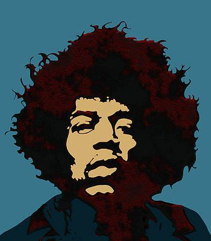
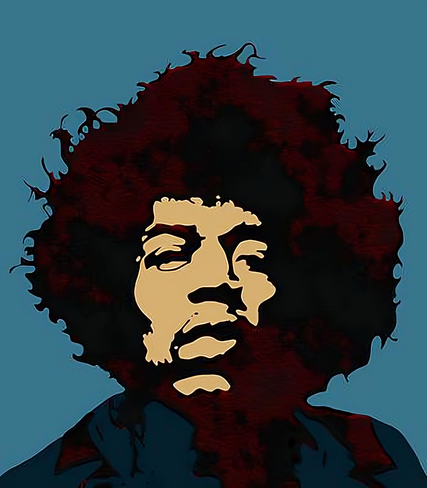
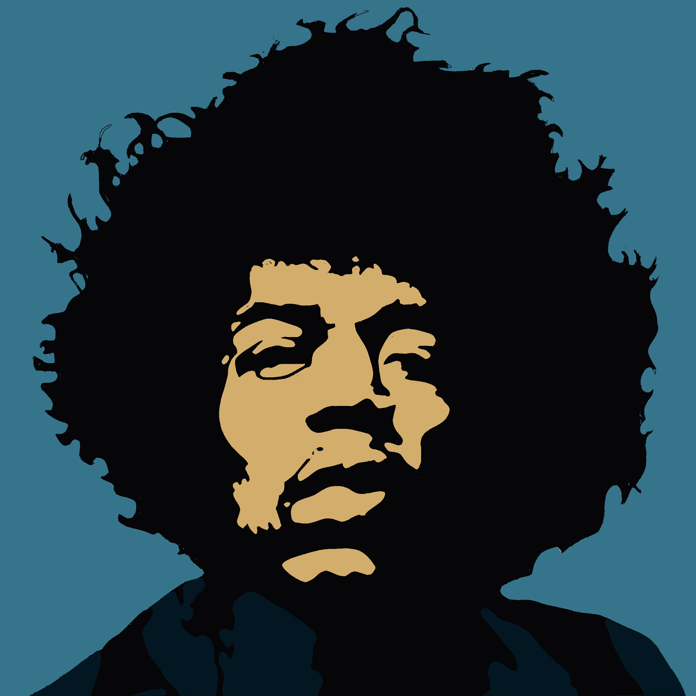
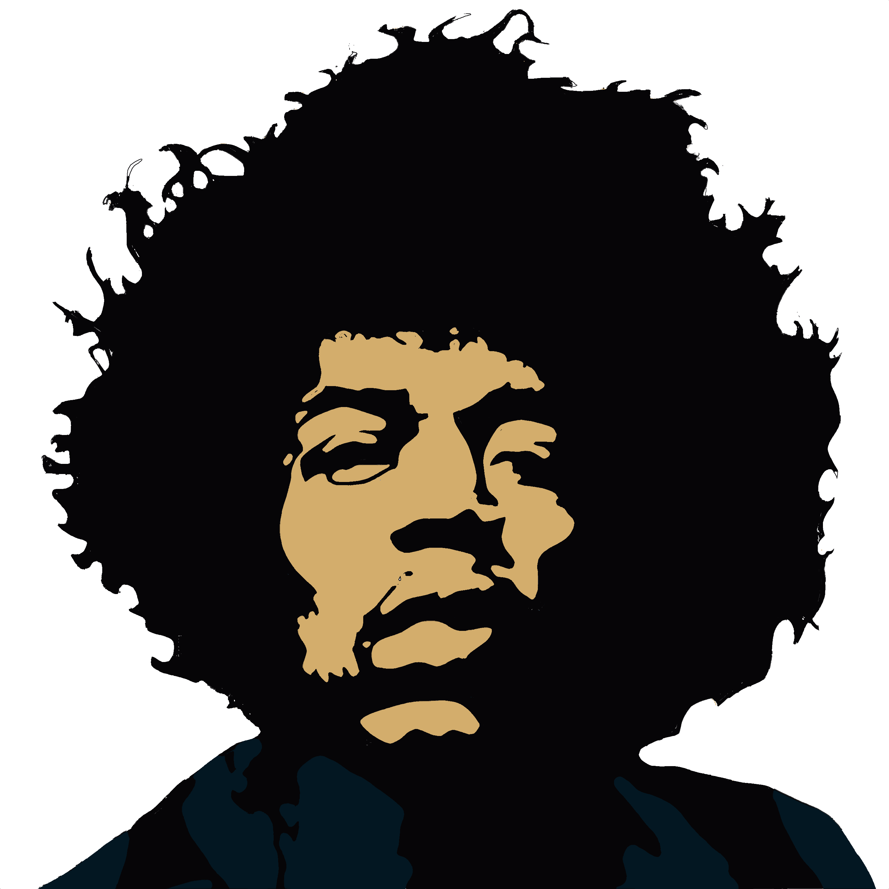

# `jimi` | *Jimi Hendrix Icon*

> *4 color Jimi Hendrix pop art icon for 8rents accounts*

---

## In this README

- [Directories](#directories) – understanding image paths and directory structure.
- [History](#history) - Image history tracking through edits and source files.

## Directories

- **src** - original image style (square)
- **psd** – working photoshop files
- **circle** – square transparent circle icon
- **head** - head only (square)
- **inv** - inverted (square)
- **4color** - 4 color edit (image cleaned up, future edits will all be based on the 4 color)

---

### Image paths

This image uses the format 

*jimi/`image edit type`/`size`.png*

**circle icon @ 288px**

```
jimi/circle/288.png
```

**head only icon @ 1152px**

```
jimi/head/1152.png
```

**transparent background icon @ 512px**

```
jimi/trans/512.png
```

---

## History

### Source Origin

Image was taken from the Joy McKenzie site, chrome developer tools was used to find the hidden jpg file in the pages source code. 

*Thank you Joy!*

- **Web Page:** https://joy-mckenzie.pixels.com/featured/pop-art-jimi-hendrix-joy-mckenzie.html
- **Actual Image:** https://i.pinimg.com/736x/53/d9/ef/53d9ef30c5ec0e9109f733c68f9cecb0.jpg @350x400pxX

### Image Lineage

#### Branch: `Source / Upscale / 4 color`

- **** 
  [src/350x400.jpg](src/350x400.jpg)
  
  >  **[Source]** | *Downloaded from: <https://i.pinimg.com/736x/53/d9/ef/53d9ef30c5ec0e9109f733c68f9cecb0.jpg>*
  
  - **** 
    
    [src/2800x3200.png](src/2800x3200.png)
    
    > *Upscaled [src/350x400.jpg](src/350x400.jpg) to 2800 x 3200 pixels using AI at  [Upscale Media](https://upscale.media) and converted working file type to png*
    
    - **** 
      
      [4color/2800.png](4color/2800.png)
      
      > *Reduced colors in [src/2800x3200.png](original/2800x3200.png) from 20  to 4 using [Photopea](https://photopea.com) and cropped image to a square at 2800px*
      
      - **** 
      
        [trans/2800.png](trans/2800.png)
      
        > *Removed light blue background reducing image to 3 colors in the [ Transparent PSD File](trans/trans.psd). *
        >
        > ***Note:** need to crop image smaller than 2800 and get rid of excess white space.* 

### Future Adjustments

- Crop the white space out of the PSD File
- Clean up image history
- Remove suit section (reducing the image to 2 colors) to have just the head fit a circular plane.
- Create circle, head, inverted, variants

---

🤍 2025 8rents