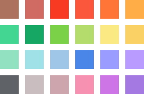

# Google Drive Folder Colors

> ***This folder contains `png` files of each of the 24 colors that Google Drive lets the user color a folder on the platform.***

---

## Each of the colors (as a separate file)

Unfortunately each of the 24 files do not contain the names that Google has assigned to the colors themselves...

                        

I can't remember why this was important that I had these all neatly isolated like so.

## The entire color pallet

**[Link to the PSD of the pallet file](pallet.psd)**

---

**🤍 2024 [Brenton Holiday](https://8rents.github.io)**
